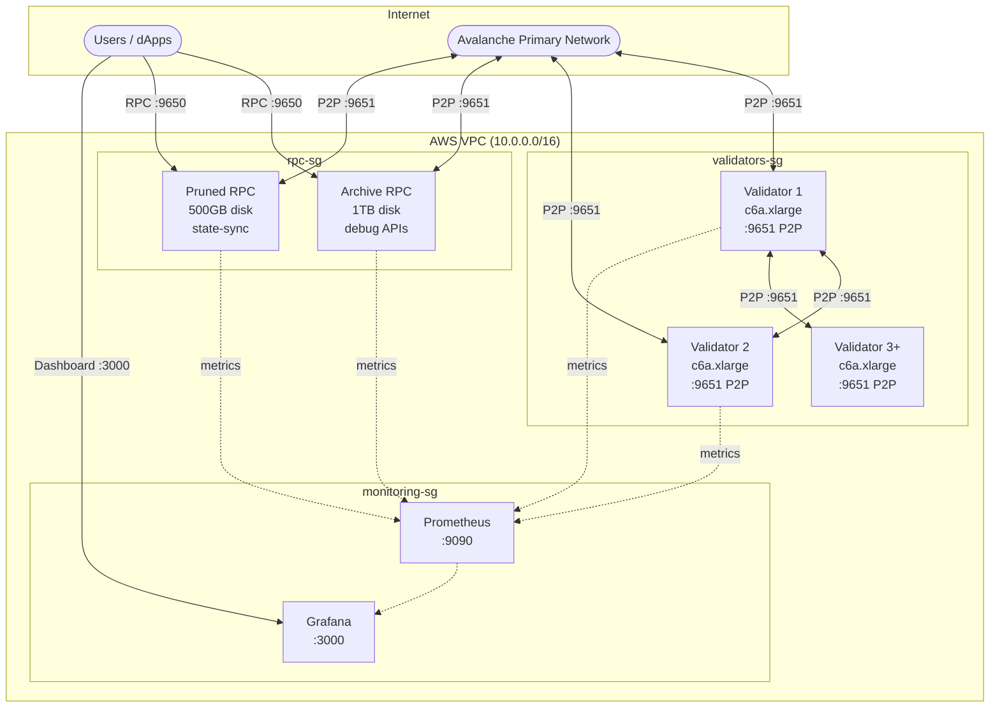

# L1 Blockchain Deployment Guide

Deploy a production-ready Avalanche L1 blockchain with validators, RPC nodes, and monitoring.

## Architecture



> This architecture diagram reflects the AWS topology with archive + pruned RPC split.
> GCP/Azure currently use a generic `rpc` pool.

## Infrastructure Sizing

| Component | Instance | Disk | Purpose |
|-----------|----------|------|---------|
| Validators (default: 3, common production: 5) | c6a.xlarge | 500GB EBS | Block production, consensus |
| Archive RPC | c6a.xlarge | 1TB EBS | Full history, debug APIs, Blockscout |
| Pruned RPC | c6a.large | 500GB EBS | State-sync, transaction workloads |
| Monitoring | t3.small | 50GB EBS | Prometheus, Grafana |

**RPC Node Types:**

| Type | APIs | Pruning | State-Sync | Use Case |
|------|------|---------|------------|----------|
| Archive | Full (incl. debug/trace) | Disabled | Disabled | Block explorer, debugging, historical queries |
| Pruned | Standard (eth, net, web3) | Enabled | Enabled | Transaction submission, latest state queries |

## Step-by-Step Deployment

### Prerequisites

```bash
# macOS
brew install terraform ansible awscli jq go shellcheck

# Or use make
make setup
```

### 1. Configure AWS & SSH

```bash
# Set AWS credentials
export AWS_ACCESS_KEY_ID="..."
export AWS_SECRET_ACCESS_KEY="..."

# Generate SSH key
ssh-keygen -t rsa -b 4096 -f ~/.ssh/avalanche-deploy -N ""
```

### 2. Configure Terraform

```bash
cd terraform/l1/aws
cp terraform.tfvars.example terraform.tfvars
```

Edit `terraform.tfvars`:
```hcl
name_prefix       = "my-l1"
environment       = "fuji"
validator_count   = 5
rpc_archive_count = 1
rpc_pruned_count  = 1
ssh_public_key    = "ssh-rsa AAAA..."
ssh_private_key_file = "~/.ssh/avalanche-deploy"
enable_staking_key_backup = true
```

#### NOTE: NOT ENABLED for my POC - Remote State (optional, recommended for teams)

By default Terraform keeps state in a local `terraform.tfstate` — fine for a
solo trial run, but it has no locking, isn't shared, and goes stale (we have
been bitten by applying against months-old local state from a destroyed
deployment). To switch this root to a shared S3 backend:

```bash
cd terraform/l1/aws
cp backend.tf.example backend.tf   # edit bucket/region/locking inside
terraform init -migrate-state      # copies existing local state into S3
```

Notes:

- **The S3 bucket must already exist.** Terraform must never create its own
  state bucket (some of our accounts deny `s3:CreateBucket` via SCP). Create
  it out-of-band with versioning + encryption, or reuse a shared one.
- **State locking:** on Terraform >= 1.10 use `use_lockfile = true` (S3-native,
  no extra infra). On older Terraform (this repo pins only `>= 1.5`) use a
  pre-existing DynamoDB table via `dynamodb_table`. The example file documents
  both.
- **Distinct `key` per root:** `l1/aws` and `primary-network/aws` must never
  share a state key. The example files already use distinct keys.
- **All operators must switch together.** Commit `backend.tf` once migrated;
  one operator on local state and another on S3 will clobber each other.
- Local state remains the default — without a `backend.tf`, nothing changes.

### 3. Create Infrastructure

```bash
##
# Create aws resources, security group, ingress/egress rules.  No Avalanche resources (e.g. avago) are created yet.
# See terraform/l1/aws/outputs.tf for the outputs that are generated.  These outputs are used by the ansible playbooks to configure the Avalanche nodes.
##
make infra    
```

### 4. Deploy Avalanchego

```bash
make deploy

### Output of this step ####

PLAY [Deploy Avalanche Nodes (Phase 1 - Primary Network Sync)] 

TASK [avalanchego : Create directories] 
changed: [validator-2] => (item=/var/lib/avalanchego)
...

TASK [avalanchego : Resolve release asset name for this architecture] 
27     avalanchego_release_arch: "{{ 'arm64' if ansible_architecture in ['aarch64', 'arm64'] else 'amd64' }}"
                                 ^ column 31
TASK [avalanchego : Install avalanchego binary and bundled subnet-evm plugin]
TASK [avalanchego : Resolve release tarball name] 

TASK [avalanchego : Install grafted subnet-evm plugin (restart only on change)] 
TASK [avalanchego : Install subnet-evm plugin (restart only on change)] 
TASK [avalanchego : Find downloaded subnet-evm tarballs] 

TASK [avalanchego : Clean up download artifacts] 
changed: [validator-2] => (item=/tmp/avalanchego-linux-amd64-v1.15.0-fuji.tar.gz)
changed: [validator-2] => (item=/tmp/subnet-evm-linux-amd64-v1.15.0-fuji.tar.gz)
...

TASK [avalanchego : Resolve custom node config path] 
TASK [avalanchego : Load custom node config from repository config directory]
TASK [avalanchego : Build base node configuration] 
TASK [avalanchego : Add subnet tracking to config] 
TASK [avalanchego : Add L1 bootstrap info to config] 
TASK [avalanchego : Merge custom config with base config]

[validator-1] => {"msg": "avalanchego service is active on validator-1"}
[validator-2] => {"msg": "avalanchego service is active on validator-2"}
[rpc-archive-1] => {"msg": "avalanchego service is active on rpc-archive-1"}
[rpc-pruned-1] => "msg": "avalanchego service is active on rpc-pruned-1"}

[validator-1] => {"msg": "validator-1: P-Chain still bootstrapping - normal for a fresh node; the service is up and the API is responding"}
[validator-2] => {"msg": "validator-2: P-Chain still bootstrapping - normal for a fresh node; the service is up and the API is responding"}
[rpc-archive-1] => {"msg": "rpc-archive-1: P-Chain still bootstrapping - normal for a fresh node; the service is up and the API is responding"}
[rpc-pruned-1] => {"msg": "rpc-pruned-1: P-Chain still bootstrapping - normal for a fresh node; the service is up and the API is responding"}
    
[validator-1] => { "msg": "validator-1: NodeID-K6cwgvj9CUrLRjF6gieVjHs6aGZo2Pski"}
[validator-2] => {"msg": "validator-2: NodeID-CE4LDYiXYTmEfqHqsVGJojBLrG9ser6wD"}
[rpc-archive-1] => {"msg": "rpc-archive-1: NodeID-KLSsBCkDb8HQVLtqv65jFhfxnWA5bUFnd"}
[rpc-pruned-1] => {"msg": "rpc-pruned-1: NodeID-KiuodpFFeG5iSt8GF53EEiasX9h5Va8Ro"}
	
[validator-1] => {"msg": "Staking keys backed up to s3://vdn-sl-b-validator-keys/validator-1/staking-keys.tar.gz"}
[validator-2] => {"msg": "Staking keys backed up to s3://vdn-sl-b-validator-keys/validator-2/staking-keys.tar.gz"}

Phase 1 Complete - Nodes Deployed.  Node IDs saved to: ansible/node_ids.txt.S taking keys backed up to S3 (if enabled).
Next steps:
1.  Wait for nodes to sync with fuji.  Check: curl http://<node-ip>:9650/ext/health
2.  Create your L1:  cd tools/create-l1
export AVALANCHE_PRIVATE_KEY=PrivateKey-..
./create-l1 --network=fuji --validators=<ip1>,<ip2>,<ip3> --genesis=../../configs/l1/genesis/genesis.json
3.  Configure nodes with your L1:  SUBNET_ID=<from-create-l1-output>
ansible-playbook playbooks/l1/configure.yml -e subnet_id=$SUBNET_ID

PLAY RECAP *******
  localhost                  : ok=1 ...
  rpc-archive-1              : ok=53
  rpc-pruned-1               : ok=53
  validator-1                : ok=62
  validator-2                : ok=62

	
make status   # Wait for "P:OK" on all nodes
```

### 5. Create Your L1

> **Prerequisites:** the `platform` CLI is not installed by `make setup`. Install it with:
>
> ```bash
> go install github.com/ava-labs/platform-cli@latest
> ```
>
> (`go install` names the binary `platform-cli`; alias it to `platform`, or build from source with `go build -o platform .` as shown in the [platform-cli README](https://github.com/ava-labs/platform-cli).)
> 
> (platform version results in 'platform dev')
>
> **No extra tool needed:** you can skip platform-cli entirely and export your key directly — `export AVALANCHE_PRIVATE_KEY=0x...`. The tools accept raw hex or `PrivateKey-` CB58. Key precedence: `--key-name` > `AVALANCHE_PRIVATE_KEY` > keystore default.
>
> **Funding:** you need ~1.5+ AVAX on the Fuji P-Chain (1 AVAX per validator balance + fees) — fund via <https://core.app/tools/testnet-faucet> (C-Chain) then transfer C→P, or ask in the thread.

```bash
# Key generation (platform-cli keystore)
ubuntu@ip-10-8-3-214:~$ platform keys generate --name my-l1-key-admin-created-from-platform-cli
Keys metadata stored at:  /home/ubuntu/.platform/keys/my-l1-key-admin-created-from-platform-cli.key 
- "ciphertext" s the encrypted version of your private key when it is stored at rest on your machine.  Storing a raw private key (plaintext) is a security risk.  The platform-cli encrypts your private key with a 
password and stores it in the keystore.

Every time you execute a command to transfer funds (like avalanche key transfer), the CLI reads this ciphertext, asks you for your passphrase to unlock it, turns it back into the plaintext key in your computer 
temporary memory, signs the transaction, and immediately wipes it.

- "salt" a random string of data added to an input (like a password or passphrase) before it is passed through a cryptographic function for encryption
- "nonce" stands for "number used once.".  This ensures that encrypting the same data twice results in completely different ciphertext.

# Recommended key flow (platform-cli keystore)
platform keys import --name l1-deployer
platform keys default --name l1-deployer

# Build and run create-l1 tool


OR
make create-l1
./tools/create-l1/create-l1 \
  --network=fuji \
  --key-name=[REPLACE_WITH_YOUR_CHAINNAME, e.g. my-l1-key-admin] \
  --validators=$(cd terraform/l1/aws && terraform output -json validator_ips | jq -r 'join(",")') \
  --chain-name=[REPLACE_WITH_YOUR_CHAINNAME] \
  --output=l1.env
```

`l1.env` includes `SUBNET_ID`, `CHAIN_ID`, `CONVERSION_TX`, and `EVM_CHAIN_ID` (when `chainId` exists in your genesis file, default `configs/l1/genesis/genesis.json`).

### 6. Configure Nodes for L1

```bash
source l1.env
make configure-l1 SUBNET_ID=$SUBNET_ID CHAIN_ID=$CHAIN_ID
make status
```

This automatically deploys **eRPC** as a load balancer in front of your RPC nodes (auto-detected from `configs/l1/genesis/genesis.json`). To skip eRPC, add `SKIP_ERPC=true`.

Your L1 is now running:

- **Direct RPC**: `http://<rpc-ip>:9650/ext/bc/<chain-id>/rpc`
- **eRPC (recommended)**: `http://<monitoring-ip>:4000` — load balanced, cached, automatic failover
- **eRPC Health**: `http://<monitoring-ip>:4000/healthcheck`

## Optional: Initialize Validator Manager

If your genesis includes a ValidatorManager proxy contract:

```bash
# Requires foundry
curl -L https://foundry.paradigm.xyz | bash && foundryup

# Set icm-contracts path
export ICM_CONTRACTS_PATH=~/code/icm-contracts

# Initialize
source l1.env
make initialize-validator-manager \
  SUBNET_ID=$SUBNET_ID \
  CHAIN_ID=$CHAIN_ID \
  CONVERSION_TX=$CONVERSION_TX \
  PROXY_ADDRESS=0x... \
  EVM_CHAIN_ID=$EVM_CHAIN_ID
```

### Warp signature for `initializeValidatorSet`

The final step (`initializeValidatorSet`) needs a BLS-aggregated `SubnetToL1Conversion` warp
message. Two ways to obtain it:

- **Glacier (public testnet/mainnet L1s):** default. Needs `GLACIER_API_KEY`.
- **Local signature aggregator (private/custom L1s):** run an `ava-labs/icm-services`
  `signature-aggregator` peered to your validators (`signing-subnet-id` = your L1 subnet), then
  pass `-e use_local_sig_agg=true` (and `-e sig_agg_url=...`) to the playbook, or run the tool
  directly with `--local-sig-agg`. For private L1s, SubnetEVM verifies the conversion message
  against the **L1's own validator set**, so the signatures must come from your validators, not
  the Primary Network.

  Also pass the real **conversion ID** with `--conversion-id` (cb58 or `0x`-hex). This is the hash
  of the conversion *data* and is **not** the `ConvertSubnetToL1Tx` hash (`$CONVERSION_TX`). If a
  validator rejects the request, its error reports the expected value
  (`provided conversionID X != expected Y`).

## Genesis Configuration

Use the **[Genesis Builder](https://build.avax.network/tools/l1-toolbox/create-chain)** to generate your genesis JSON visually, then save it at `configs/l1/genesis/genesis.json`.

Key settings:
- `chainId` - Unique EVM chain ID ([check availability](https://chainlist.org/))
- `feeConfig` - Gas limits and base fees
- `warpConfig` - Cross-chain messaging (Avalanche Interchain Messaging)
- `alloc` - Pre-funded addresses

## Cost Estimate (AWS us-east-1)

| Component | Count | Monthly |
|-----------|-------|---------|
| Validators | 5 | ~$450 |
| Archive RPC | 1 | ~$120 |
| Pruned RPC | 1 | ~$65 |
| Monitoring | 1 | ~$15 |
| S3 + KMS | - | ~$1 |
| **Total** | | **~$651/mo** |

## Kubernetes Alternative

This guide covers the Terraform + Ansible path. To deploy L1 infrastructure on an existing Kubernetes cluster instead, see the [Kubernetes deployment guide](../../kubernetes/README.md).

## Next Steps

- [Deploy add-ons](ADD-ONS.md) (Blockscout, faucet, The Graph, ICM Relayer)
- [Operations guide](../OPERATIONS.md) (upgrades, monitoring, health checks)
- [Troubleshooting](../TROUBLESHOOTING.md)
